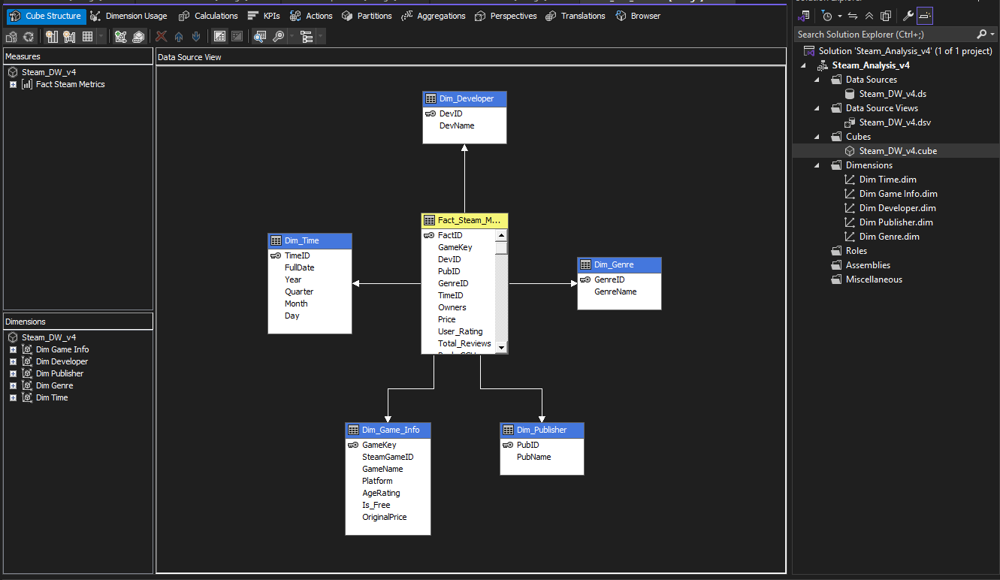

# 🎮 Steam Store Data Warehouse & Analytics

## 📖 Giới thiệu (Overview)
Đồ án xây dựng hệ thống **Kho dữ liệu (Data Warehouse)** và **Khai thác dữ liệu (Data Mining)** trên nền tảng Steam Store. Dự án nhằm mục đích phân tích các yếu tố ảnh hưởng đến doanh thu, xu hướng người chơi và dự báo khả năng thành công (`Super_Hit` vs `Flop`) của một tựa game dựa trên dữ liệu lịch sử.

Dự án thực hiện trọn vẹn quy trình từ **Tiền xử lý dữ liệu (Python)** $\rightarrow$ **ETL (SSIS)** $\rightarrow$ **Lưu trữ (SQL Server)** $\rightarrow$ **Phân tích đa chiều (SSAS)** $\rightarrow$ **Trực quan hóa (Power BI)**.

---

## 🚀 Kiến trúc hệ thống (System Architecture)

Dữ liệu đi qua quy trình xử lý khép kín:
1.  **Raw Data:** Dữ liệu thô (~90.000 dòng) từ Steam Store.
2.  **Pre-processing (Python):** Làm sạch, tính toán chỉ số, cân bằng dữ liệu.
3.  **Staging Area:** Vùng đệm lưu trữ trên SQL Server.
4.  **Data Warehouse:** Tổ chức theo mô hình **Star Schema**.
5.  **Analytics & Mining:** Phân tích OLAP và chạy mô hình Machine Learning.

---

## 🛠 Công nghệ sử dụng (Tech Stack)

| Lĩnh vực | Công nghệ / Công cụ |
| :--- | :--- |
| **Database** | Microsoft SQL Server (Star Schema Design) |
| **ETL** | SSIS (SQL Server Integration Services) |
| **OLAP** | SSAS (SQL Server Analysis Services), MDX Queries |
| **Programming** | Python (Pandas, NumPy, Scikit-learn) |
| **Visualization** | Power BI, Google Data Studio |
| **Tools** | Visual Studio, SSMS, Jupyter Notebook |

---

## 💡 Các tính năng nổi bật (Key Features)

### 1. Tiền xử lý dữ liệu nâng cao (Advanced Pre-processing)
Sử dụng **Python** để xử lý bộ dữ liệu thô phức tạp:
* **Owners Estimation:** Áp dụng thuật toán **Clamped Boxleiter** (dựa trên Total Reviews và tham số kẹp Min-Max) để ước lượng chính xác số lượng người sở hữu game thay vì khoảng giá trị.
* **Genre Balancing:** Sử dụng kỹ thuật **Soft-Cap** (Hạn ngạch mềm) để giới hạn số lượng game mỗi thể loại, giải quyết vấn đề mất cân bằng dữ liệu (Imbalanced Data).
* **Deduplication:** Khử trùng lặp dựa trên khóa phức hợp *(Name + ReleaseDate + Developer)*.
* **Kết quả:** Tinh lọc từ **90.000+** dòng xuống còn **45.598** dòng dữ liệu chất lượng cao.

### 2. Quy trình ETL tối ưu (SSIS)
* Xây dựng luồng xử lý tự động với **SSIS Package**.
* Sử dụng **Multicast** để tải dữ liệu song song vào các bảng Dimension.
* Sử dụng **Lookup Transformation** để ánh xạ khóa ngoại (Foreign Keys) khi nạp bảng Fact.
* Cơ chế **Load Staging** giúp đảm bảo tính toàn vẹn dữ liệu và khả năng phục hồi lỗi (Restartability).

### 3. Khai thác dữ liệu (Data Mining)
* Xây dựng mô hình dự báo mức độ thành công của game: **Super_Hit** (Thành công) hoặc **Flop** (Thất bại).
* **Thuật toán:** Decision Tree (Cây quyết định) và Naive Bayes.
* **Kết quả:** Đánh giá độ chính xác (Accuracy), Precision, Recall và đề xuất giải pháp cải thiện (SMOTE, Feature Engineering).

---

## 📊 Mô hình dữ liệu (Data Model)

Hệ thống được thiết kế theo mô hình **Star Schema** (Lược đồ hình sao) bao gồm:
* **1 Fact Table:** `Fact_Steam_Store` (Lưu trữ Revenue, Owners, Playtime...)
* **4 Dimension Tables:**
    * `Dim_Genre`
    * `Dim_Platform`
    * `Dim_Developer`
    * `Dim_Publisher`

---

## 📈 Kết quả đạt được (Screenshots)

### 1. Luồng xử lý SSIS (ETL Flow)
.png)
.png)
.png)
.png)

### 2. SSAS khối Cube

### 3. Dashboard báo cáo (Power BI)
.png)
.png)

---

## 📝 License
This project is for educational purposes.
